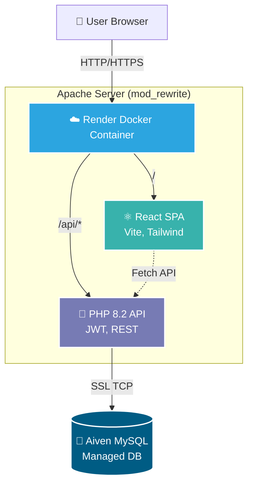

# 🎓 UIU Club Management System (CMS Pro) - Enterprise Edition

[](https://reactjs.org/)
[](https://vitejs.dev/)
[](https://tailwindcss.com/)
[](https://www.php.net/)
[](https://www.mysql.com/)
[](https://www.docker.com/)

Welcome to the upgraded **United International University (UIU) Club Management System**. Originally a legacy procedural PHP application, this platform has been completely re-architected into a modern, industry-grade **React (Vite) Single Page Application** with a stateless **PHP 8 REST API** backend and a fully normalized **MySQL** database.

This unified platform handles everything from secure club voting to automated QR code event check-ins.

---

## ✨ Enterprise Features

1. **🔒 Stateless Authentication (JWT & RBAC):** Secure, role-based access control (SuperAdmin, Faculty, Club Executive, Student).
2. **🗳️ Digital Election System:** Strict verification ensures only active club members can cast a vote.
3. **🏫 Facility & Equipment Booking Engine:** Automated conflict-prevention algorithms for reserving campus auditoriums.
4. **📅 Event Ticketing & QR Check-in:** Automatically generates secure QR code tickets and issues attendance certificates.
5. **💬 Alumni Mentorship & Forums:** A unified hub for networking, discussions, and alumni outreach.
6. **💰 Budget Request Workflow:** Multi-tier approval system for club funding and expense tracking.
7. **🩸 Blood Donor Directory:** Searchable directory mapping students by blood group for emergencies.

---

## 🏗️ Architecture & Tech Stack

This project utilizes a highly decoupled yet easily deployable architecture:



- **Frontend:** React.js, Vite, Tailwind CSS, React Router DOM, Lucide Icons.
- **Backend:** PHP 8.2 (Raw PHP with a custom RESTful Routing Engine).
- **Database:** MySQL / MariaDB (Prepared statements prevent SQL injection).
- **Deployment:** Multi-stage Docker build serving both React statics and PHP API via Apache (`mod_rewrite`).

---

## 🚀 Production Deployment (Render + Aiven)

This project is configured for a **zero-configuration single-container deployment** on [Render](https://render.com) using Docker, backed by a managed MySQL database on [Aiven](https://aiven.io).

### 1. Database Setup (Aiven)
1. Create a free **MySQL 8** service on Aiven.
2. Note your connection credentials (Host, Port, User, Password, Database).

### 2. Application Deployment (Render)
1. Create a new **Web Service** on Render and connect this GitHub repository.
2. Render will automatically detect the `Dockerfile` (Environment: Docker).
3. Under **Advanced**, add the following **Environment Variables**:
   - `DB_HOST` = (Your Aiven Host, e.g., `mysql-...l.aivencloud.com`)
   - `DB_PORT` = `10955` (Default Aiven port)
   - `DB_USER` = `avnadmin`
   - `DB_PASS` = (Your Aiven Password)
   - `DB_NAME` = `defaultdb`
   - `DB_SSL` = `true` (Required for Aiven)
   - `JWT_SECRET` = (A random, secure 64-character string)

### 3. Initialize Database Tables
Once the deployment is "Live", open the **Shell** tab in your Render dashboard and run the automated migration script:
```bash
php database/migrate_legacy_data.php
```
*This will instantly create your tables and insert the default super-admin user.*

---

## 💻 Local Development Setup

If you wish to run the frontend and backend locally for active development:

### Prerequisites
- Node.js (v20+)
- PHP (v8.0+)
- MySQL Server (e.g., XAMPP, MAMP)

### 1. Database
Create a database named `cms`. Import the schema and seeders:
```bash
mysql -u root -p cms < database/schema.sql
mysql -u root -p cms < database/seeders.sql
```

### 2. Backend (PHP REST API)
Open a terminal in the root directory and start the PHP development server:
```bash
php -S localhost:8000 -t ./
```

### 3. Frontend (React SPA)
Open a *second* terminal, navigate to the `frontend` folder, install packages, and run Vite:
```bash
cd frontend
npm install
npm run dev
```
*(The frontend will run on `http://localhost:5173` and automatically proxy `/api` requests to your PHP server)*.

---

## 🔑 Default Test Accounts
After running the `seeders.sql` script, you can log in with:
- **SuperAdmin:** `admin@uiu.ac.bd` (Password: `password123`)
- **Student:** `student1@uiu.ac.bd` (Password: `password123`)

---

## 🛡️ Security

- **SQL Injection Prevention:** Every database interaction is handled securely via `mysqli` Prepared Statements.
- **XSS Protection:** React natively sanitizes output to prevent Cross-Site Scripting.
- **Stateless Tokens:** Sessions are managed exclusively via stateless JWTs, immune to CSRF if stored in memory.

---
*Built for United International University (UIU).*